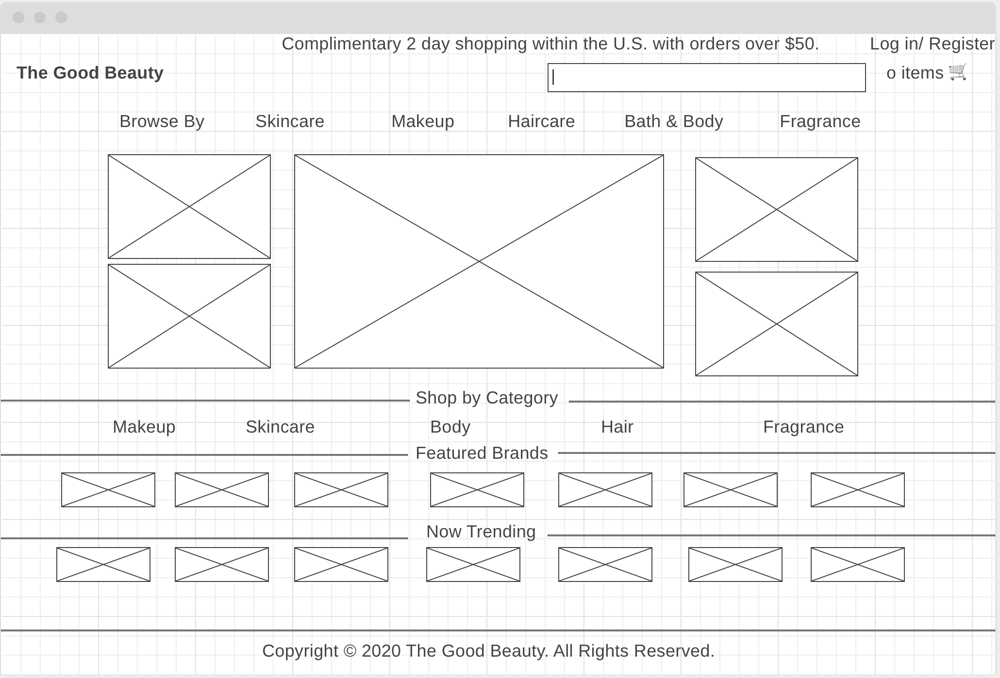
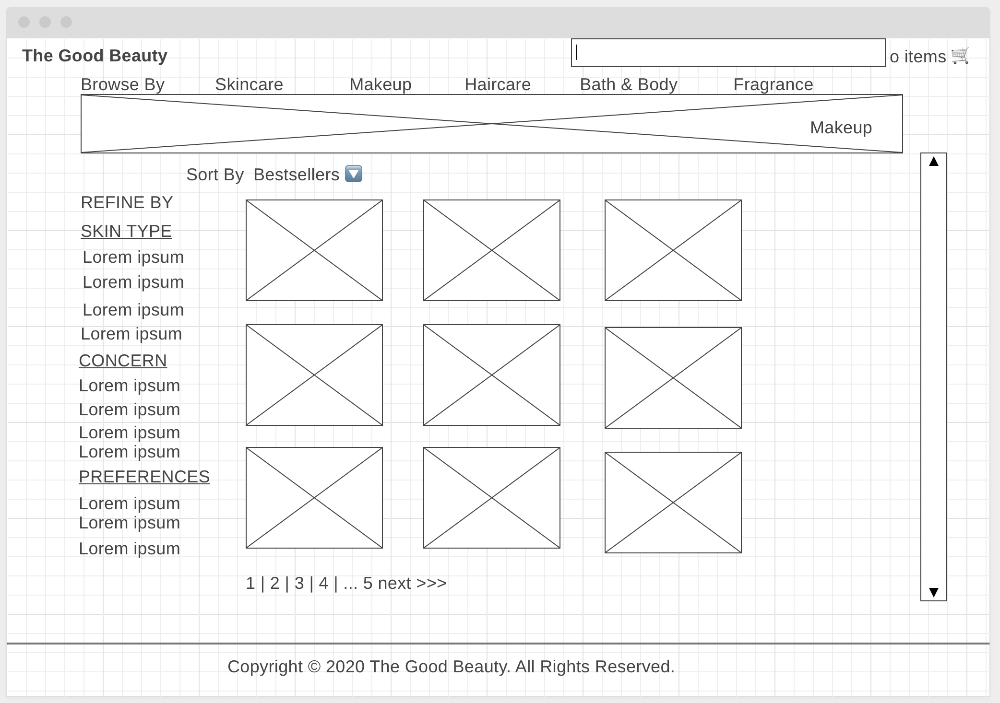
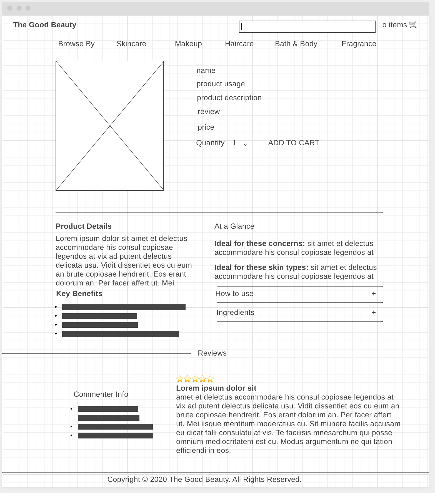
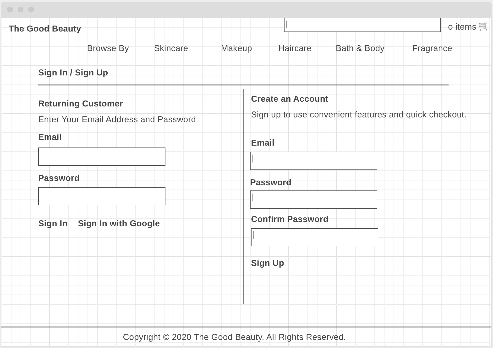

## [MEI](https://jovial-fermi-9b4af1.netlify.app/)

<br>

- [Project Planning](#project-planning)
  - [Overview](#overview)
  - [Wireframes](#wireframes)
  - [MVP](#mvp)
    - [Goals](#goals)
    - [Libraries](#libraries)
    - [Data](#data)
    - [Component Hierarchy](#component-hierarchy)
    - [Component Breakdown](#component-breakdown)
    - [Component Estimates](#component-estimates)
- [Project Delivery](#project-delivery)
  - [Code Showcase](#code-showcase)

<br>

### Overview

**The Good Beauty**

**Project Description**

The Good Beauty is an e-commerce site for beauty products. The site is built on "makeup api". Users will be able to search prodcuts by brand, categories etc..

<br>

### Wireframes

#### Homepage



#### Shopping Page



#### Product Details Page



#### Sign in and Sign Up page



<br>

### MVP

1. The site will allow users to browse through beauty products by brands/categories.
2. The site will render different categories/brands page when clicked.
3. The site will render a product page when a product is clicked.
4. Users will be able search for products by name, brand, concern, etc...

<br>

#### Goals

- _search for products by category/brand name_
- _drop down list with relevant sub categories_
- _sign in and sign up up with user auth functionality_
- _small screen friendly._

<br>

#### Libraries


|       Library       | Description                                   |
| :-----------------: | :-------------------------------------------- |
|    React Router     | allow routing through pages                   |
|  React Material UI  | css design                                    |
|        axios        | fetch api data                                |
| Firebase (post MVP) | to allow user's to login/register with google |

<br>

#### Data

|    API     | Quality Docs? | Website                             | Sample Query                                                          |
| :--------: | :-----------: | :---------------------------------- | :-------------------------------------------------------------------- |
| makeup API |      yes      | _https://makeup-api.herokuapp.com/_ | _http://makeup-api.herokuapp.com/api/v1/products.json?brand=clinique_ |

```
[
    {
        "id": 1048,
        "brand": "colourpop",
        "name": "Lippie Pencil",
        "price": "5.0",
        "price_sign": "$",
        "currency": "CAD",
        "image_link": "https://cdn.shopify.com/s/files/1/1338/0845/collections/lippie-pencil_grande.jpg?v=1512588769",
        "product_link": "https://colourpop.com/collections/lippie-pencil",
        "website_link": "https://colourpop.com",
        "description": "Lippie Pencil A long-wearing and high-intensity lip pencil that glides on easily and prevents feathering. Many of our Lippie Stix have a coordinating Lippie Pencil designed to compliment it perfectly, but feel free to mix and match!",
        "rating": null,
        "category": "pencil",
        "product_type": "lip_liner",
        "tag_list": [
            "Vegan",
            "cruelty free"
        ],
```

<br>

#### Component Hierarchy

> Use this section to define your React components and the data architecture of your app.

```
src
|__ assets/
      |__ data-tests
      |__ mockups
|__ components/
      |__ header/
            |__ header.component.jsx
            |__ header.styles.css
      |__ footer/
            |__ footer.component.jsx
            |__ footer.styles.css
      |__ search/
            |__ search.component.jsx
            |__ search.styles.css
      |__ nav-links/
            |__ nav-links.component.jsx
            |__ nav-links.styles.css

|__ pages/
      |__ home/
            |__ home.component.jsx
            |__ home.styles.css
      |__ shop/
            |__ shop.component.jsx
            |__ shop.styles.css
      |__ product-detail/
            |__ detail.component.jsx
            |__ detail.styles.css
      |__ sign-in-sign-up/
            |__ sign-in-sign-up.component.jsx
            |__ sign-in-sign-up.styles.css
```

<br>

#### Component Breakdown


|      Component       |    Type    | State | Props | Description                                                                                 |
| :------------------: | :--------: | :---: | :---: | :------------------------------------------------------------------------------------------ |
|        Header        | functional |   n   |   n   | The header will contain a brief intro and link to Login/Register page.                      |
|      Navigation      | functional |   y   |   y   | Each navigation item(being 5 categories) will provide a list of links to each of the pages. |
|      Shop Page       | functional |   y   |   y   | The shoppage will render each product by category/brand.                                    |
|     Produc Page      | functional |   y   |   y   | The Product page will have a detail description of the clicked.                             |
| Sign in Sign up page | functional |   y   |   y   | The Product page will have a detail description of the page clicked with customer reviews.  |
|        Footer        | functional |   n   |   n   | The footer will show info about me and a link to my portfolio.                              |

<br>

#### Component Estimates


| Task                                    | Priority | Estimated Time | Time Invested | Actual Time |
| --------------------------------------- | :------: | :------------: | :-----------: | :---------: |
| Create pages (shop/product/sign in)     |    H     |     10 hrs     |       8       |     10      |
| Create components to be reused in pages |    H     |     10 hrs     |      16       |     16      |
| Implement Firebase auth and login       |    H     |     10 hrs     |       0       |      0      |
| CSS                                     |    H     |     15 hrs     |      20       |     20      |
| TOTAL                                   |          |     45 hrs     |      44       |     44      |

<br>


| const CustomButton = ({ children, ...otherProps }) => {
const { button } = useStyles();
return (
<Button
className={button}
variant="contained"
color="primary"
{...otherProps} >
{children}
</Button>
);
}; | This is a custom made button component that could be used for any project from here on. |


<br>

---

## Project Delivery

### Code Showcase

```
const ProductNotFoundPage = () => {
  const { keyword } = useParams();
  const { wrapper, list } = useStyles();
  return (
    <div className={wrapper}>
      <Typography variant="h3" textSecondary>
        SORRY!
      </Typography>
      <Typography variant="h6">
        We couldn't find any search results for "{keyword}"
      </Typography>
      <ul className={list}>
        <li>Check for typos or misspellings</li>
        <li>Search for brands, concerns, or products</li>
      </ul>
    </div>
  );
};

```

