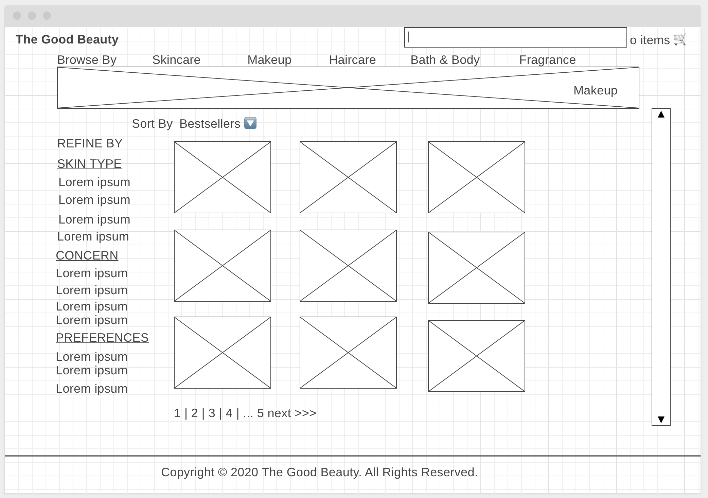
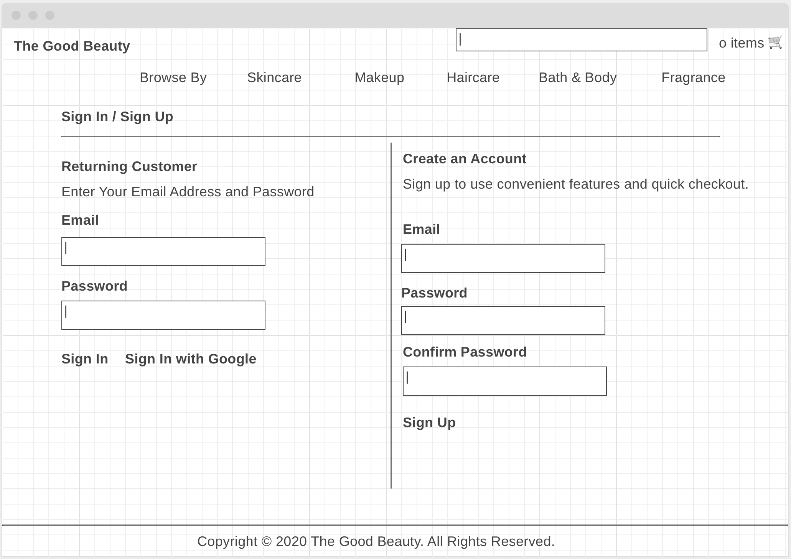

- [Project Planning](#project-planning)
  - [Overview](#overview)
  - [Wireframes](#wireframes)
  - [MVP](#mvp)
    - [Goals](#goals)
    - [Libraries](#libraries)
    - [Data](#data)
    - [Component Hierarchy](#component-hierarchy)
    - [Component Breakdown](#component-breakdown)
    - [Component Estimates](#component-estimates)
    - [Helper Functions](#helper-functions)
  - [Post-MVP](#post-mvp)
- [Project Delivery](#project-delivery)
  - [Code Showcase](#code-showcase)
  - [Code Issues & Resolutions](#code-issues--resolutions)

## Project Planning

> This section should be completed for your project pitch with instructors.
>
> To ensure correct Markdown, it's recommended that you copy and paste the raw template code. The content provided is example content ONLY. You must make changes to all sections as they relate to your own project.

<br>

### Overview

**The Good Beauty**

**Project Description**

This is an e-commerce site for beauty products. I will be using an api called makeup api.

<br>

### Wireframes





<br>

### MVP

1. The site will allow users to browse through beauty products by brands/categories
2. Users will be able to sign in and register for the page
3. Users will be able search for products by name, brand, concern, etc...

\_The **Good Beauty** MVP

<br>

#### Goals

- _Lorem ipsum, dolor sit amet,_
- _consectetur adipiscing elit._
- _Phasellus dapibus fermentum risus vitae bibendum._
- _Integer vel ipsum mollis odio sollicitudin ornare eu vel ex._
- _etc._

<br>

#### Libraries

> Use this section to list all supporting libraries and their role in the project.

|      Library      | Description                                   |
| :---------------: | :-------------------------------------------- |
|   React Router    | allow routing through pages                   |
| React Material UI | css design                                    |
|     Firebase      | to allow user's to login/register with google |

<br>

#### Data

> Use the Data Section to define the API(s) you will be consuming for your project, inluding sample URL queries.

|    API     | Quality Docs? | Website       | Sample Query                            |
| :--------: | :-----------: | :------------ | :-------------------------------------- |
| WeatherAPI |      yes      | _example.com_ | _example.com/mickeymouse?s=movies&t=10_ |

```
JSON data sample from your API goes here.
```

<br>

#### Component Hierarchy

> Use this section to define your React components and the data architecture of your app.

```
[
    {
        "id": 1048,
        "brand": "colourpop",
        "name": "Lippie Pencil",
        "price": "5.0",
        "price_sign": "$",
        "currency": "CAD",
        "image_link": "https://cdn.shopify.com/s/files/1/1338/0845/collections/lippie-pencil_grande.jpg?v=1512588769",
        "product_link": "https://colourpop.com/collections/lippie-pencil",
        "website_link": "https://colourpop.com",
        "description": "Lippie Pencil A long-wearing and high-intensity lip pencil that glides on easily and prevents feathering. Many of our Lippie Stix have a coordinating Lippie Pencil designed to compliment it perfectly, but feel free to mix and match!",
        "rating": null,
        "category": "pencil",
        "product_type": "lip_liner",
        "tag_list": [
            "Vegan",
            "cruelty free"
        ],
```

<br>

#### Component Breakdown

> Use this section to go into further depth regarding your components, including breaking down the components as stateless or stateful, and considering the passing of data between those components.

|  Component   |    Type    | State | Props | Description                                                      |
| :----------: | :--------: | :---: | :---: | :--------------------------------------------------------------- |
|    Header    | functional |   n   |   n   | _The header will contain the navigation and logo._               |
|  Navigation  | functional |   n   |   n   | _The navigation will provide a link to each of the pages._       |
|   Gallery    |   class    |   y   |   n   | _The gallery will render the posts using cards in flexbox._      |
| Gallery Card | functional |   n   |   y   | _The cards will render the post info via props._                 |
|    Footer    | functional |   n   |   n   | _The footer will show info about me and a link to my portfolio._ |

<br>

#### Component Estimates

> Use this section to estimate the time necessary to build out each of the components you've described above.
>
> Time frames are key to the development cycle. You have limited time to code your app, and your estimates can then be used to evalute possibilities of your MVP and post-MVP based on time needed. It's best you assume an additional hour for each component, as well as a few hours added to the total time, to play it safe.

| Task                | Priority | Estimated Time | Time Invested | Actual Time |
| ------------------- | :------: | :------------: | :-----------: | :---------: |
| Add Contact Form    |    L     |     3 hrs      |     2 hrs     |    3 hrs    |
| Create CRUD Actions |    H     |     3 hrs      |     1 hrs     |     TBD     |
| TOTAL               |          |     6 hrs      |     3 hrs     |     TBD     |

<br>

#### Helper Functions

> Use this section to document all helper functions, i.e. generic functions that can be reused in other applications.

|  Function  | Description                                |
| :--------: | :----------------------------------------- |
| Capitalize | _Lorem ipsum dolor sit amet, consectetur._ |

<br>

### Post-MVP

> Use this section to document ideas you've had that would be fun (or necessary) for your Post-MVP. This will be helpful when you return to your project after graduation!

- _Add user account and auth capabilities._
- _Utilize the Giphy API to welcome new users with funny gifs._

<br>

---

## Project Delivery

### Code Showcase

> Use this section to include a brief code snippet of functionality that you are proud of and a brief description.

```
code snippet here
```

### Code Issues & Resolutions

> Use this section to list of all major issues encountered and their resolution, if you'd like.
